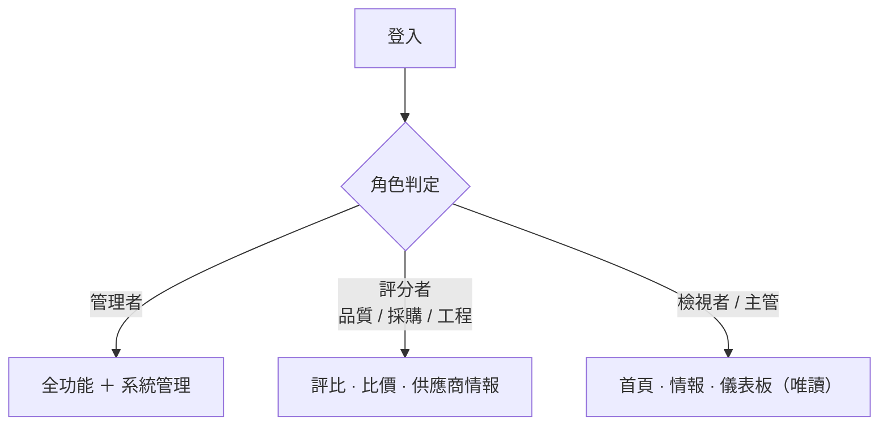
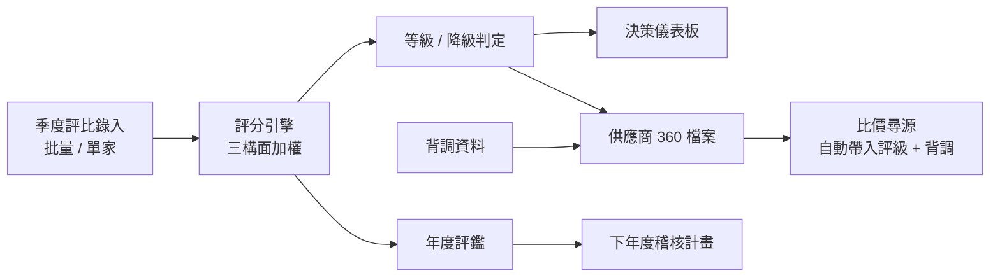
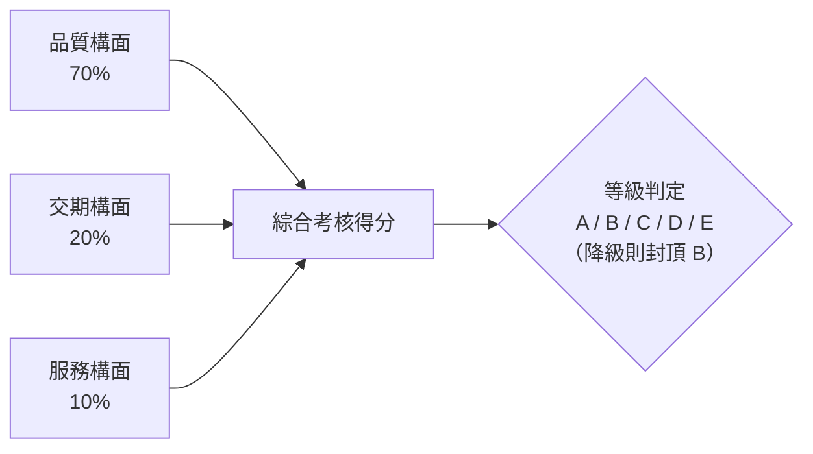
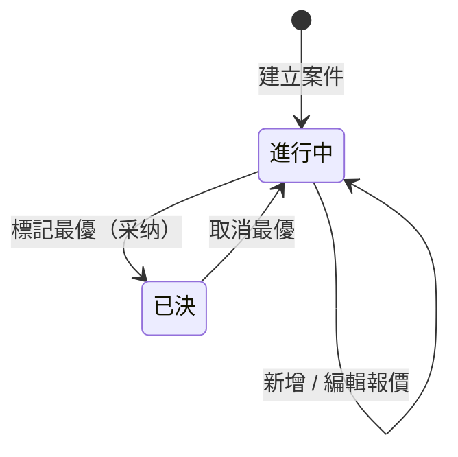

# 供應商評比系統 — 產品需求文件（PRD）

> 版本 v1.0　|　日期 2026-08-09　|　適用對象：客戶決策者、專案關係人、品質／採購／工程主管
>
> 本文件說明「供應商評比系統」的產品定位、使用者、功能範圍與需求，供客戶理解系統全貌與價值。技術計算細節另見《計算規則與判定邏輯說明》，操作步驟另見《系統操作手冊》。

---

## 1. 文件資訊

| 項目 | 內容 |
|------|------|
| 產品名稱 | 供應商評比系統（Supplier Assessment Platform） |
| 文件類型 | 產品需求文件（PRD） |
| 版本 | v1.0 |
| 狀態 | 已上線運行 |
| 撰寫單位 | 智合科技 |

---

## 2. 產品概述

### 2.1 背景與問題

過去供應商的評核分數、背景調查、比價資料分散在多份 Excel 中，帶來三個痛點：

- **資料分散**：品質、交期、服務、背調、比價各自為政，難以綜觀一家供應商的全貌。
- **人工計算易錯**：季度／年度分數與等級靠人工對表計算，規則不一致、難稽核。
- **決策缺乏依據**：選商、稽核、降級缺乏統一、可追溯的量化基礎。

### 2.2 產品願景

以「**供應商為中心**」，將評核、背調、比價整合於單一平台，讓分數由**唯一計算引擎**自動產生，並以視覺化儀表板支援選商與稽核決策。

### 2.3 核心價值

- **單一真相來源**：所有分數由同一套評分引擎計算，前後端一致、可稽核。
- **一頁綜觀**：供應商 360 檔案彙整季度、年度、背調、比價於一頁。
- **決策支援**：儀表板、排名、風險名單、比價建議，輔助選商與稽核決策。
- **效率**：批量錄入、即時算分、AI 輔助分析。

---

## 3. 目標與成功指標

| 目標 | 成功指標（KPI） |
|------|----------------|
| 取代 Excel 人工作業 | 季度／年度評比 100% 於系統內完成 |
| 分數計算一致且可稽核 | 計算規則集中於單一引擎，0 人工試算 |
| 加速選商決策 | 比價案件可於系統內完成評比與選定最優 |
| 提升資料可視性 | 主管可即時查看排名、等級分布與風險名單 |

---

## 4. 使用者與角色

系統採角色權限控管，登入後依角色顯示不同功能。

| 角色 | 對象 | 主要職責 |
|------|------|----------|
| 管理者 | 系統管理員 | 全功能，含帳號管理與評分設定 |
| 品質編輯 | 品質部門 | 季度／年度評比、背調、比價 |
| 工程師 | 工程部門 | 季度評比錄入 |
| 採購編輯 | 採購部門 | 比價尋源 |
| 檢視者 | 主管 | 檢視報表與分析（唯讀） |

### 4.1 角色分流

### 4.2 權限矩陣

| 功能 | 管理者 | 品質編輯 | 工程師 | 採購編輯 | 檢視者 |
|------|:---:|:---:|:---:|:---:|:---:|
| 首頁 / 供應商情報 / 儀表板 | ✔ | ✔ | ✔ | ✔ | ✔（唯讀） |
| 季度評比 | ✔ | ✔ | ✔ | — | — |
| 年度評鑑 / 背調 | ✔ | ✔ | — | — | — |
| 比價尋源 | ✔ | ✔ | — | ✔ | — |
| 供應商維護（新增/編輯/刪除） | ✔ | ✔ | — | — | — |
| 帳號管理 | ✔ | — | — | — | — |
| 評分設定 | ✔ | ✔ | — | — | — |

---

## 5. 功能需求

### 5.1 登入與帳號
- 帳號密碼登入；提供三種角色的示範快速登入。
- 密碼加密儲存；支援修改密碼、管理者重置密碼（可產生臨時密碼）。

### 5.2 首頁總覽
- 依角色呈現：管理者／檢視者看「供应商情报概览」（KPI、需關注清單、本季變化）；評分者看「评比工作台」（快速進入評比）。

### 5.3 供應商情報（目錄）
- 供應商清單，含當季排名、綜合分、等級；支援物料類別篩選與名稱／代碼搜尋。
- 具權限者可新增、編輯、刪除供應商；支援 AU 供應商標記（較嚴格等級門檻）。

### 5.4 供應商 360 檔案
- 單一供應商彙整頁：季度評比趨勢、年度評鑑歷史、背調四維度、參與的比價案件。
- 提供「規則式 · AI 增強」綜合評估摘要，可一鍵「问 AI 评估这家」。

### 5.5 決策儀表板
- 季度視圖：等級分布、綜合分 Top 10、多維雷達比較、排名表、風險觀察名單。
- 年度視圖：各季趨勢、等級結構、年度評鑑分布、年度綜合排名。

### 5.6 季度評比
- 批量錄入即時算分（品質 70% / 交期 20% / 服務 10%）；支援「帶入上一季」。
- 期別可封存（唯讀），管理者可解鎖修正。

### 5.7 年度評鑑
- 彙整全年季度表現，加計稽核項目（VDA/QSA/QPA/HSF），產出年度分與等級。
- 判定「下年度稽核計畫」（免稽／文件稽核／現場稽核）。

### 5.8 OSAT 評比
- 封測代工廠月度評比（品質算法採進料允收率＋基礎評分）。

### 5.9 比價尋源
- 建立比價案件、多供應商報價比對；自動帶入供應商評級與背調風險。
- 規則式「建议最优」（價格 60% + 背調 40%），可標記最優、匯出 CSV。

### 5.10 AI 助手
- 全站浮動助手，可用自然語言分析資料、歸納重點並追問；未配置時優雅降級。

### 5.11 系統管理
- 帳號管理（新增、角色切換、啟用停用、重置密碼）。
- 評分設定（品質／交期參數、等級與降級門檻，可還原預設）。

---

## 6. 核心業務流程

評比資料經引擎計算後，同時驅動儀表板、供應商檔案與年度評鑑；背調與評級再回饋到比價尋源，形成閉環。

---

## 7. 評分邏輯（概述）

每次評核由三構面加權組成，加總為考核得分，再依門檻判定等級；觸發降級判定時，等級最高封頂為 B。

> 完整公式、降級門檻、年度稽核與 OSAT 差異，詳見《計算規則與判定邏輯說明》。

---

## 8. 比價案件狀態

---

## 9. 非功能需求

### 9.1 效能
- 批量寫入（季度／年度／背調）一次完成整批，確保大量供應商同時儲存時仍即時回應。
- 報表讀取以彙總方式呈現，避免等待。

### 9.2 安全
- 登入權杖驗證；密碼加密儲存。
- 角色權限於後端強制檢查（非僅前端隱藏）。
- 敏感資訊（資料庫／金鑰）僅伺服器端可見，不外洩至瀏覽器。
- 正式庫連線經安全通道，不對外開放。

### 9.3 部署與環境
- 提供測試區（供驗證）與正式區（正式營運）兩套環境。
- 支援 Windows 與 Mac/Linux 部署。

### 9.4 資料精度
- 分數計算四捨五入至小數點後 2～3 位，確保一致。

---

## 10. 範圍

### 10.1 範圍內（v1.0）
- SQM/VQM 季度與年度評比、OSAT 月評核、背調、比價尋源、決策儀表板、AI 輔助、角色權限、系統管理。

### 10.2 範圍外／後續
- 供應商自助入口（供應商端填報）。
- 稽核工單與行動追蹤（CAPA）流程。
- 更完整的 AI 增強（自動風險預警、報告產生）。
- 比價案件的精準跳轉（由供應商檔案直接開啟指定案件）。

---

## 11. 里程碑

| 里程碑 | 內容 | 狀態 |
|------|------|------|
| M1 評分引擎 | 單一計算來源，與歷史資料校驗一致 | ✅ 完成 |
| M2 後端 | 分層 API（認證／供應商／評比） | ✅ 完成 |
| M3 前端 | 工作台 + 儀表板 | ✅ 完成 |
| M4 全模組 | 供應商情報 / OSAT / 背調 / 比價 / AI | ✅ 完成 |
| M5 供應商中心化 | 供應商 360 + 比價整合評級/背調 | ✅ 完成 |
| M6 效能與部署 | 批量寫入優化、跨平台部署 | ✅ 完成 |

---

## 12. 風險與假設

| 項目 | 說明 | 對策 |
|------|------|------|
| 網路延遲 | 正式庫存取受網路狀況影響 | 批量寫入、連線保活 |
| AI 服務可用性 | 外部 AI 服務可能不可用 | 未配置／失敗時優雅降級 |
| 資料一致性 | 評分規則變動影響歷史結果 | 規則集中管理；封存期別不受影響 |
| 假設 | 使用者於內網或可經授權存取正式庫 | — |

---

## 13. 名詞解釋

| 名詞 | 說明 |
|------|------|
| SQM / VQM | 供應商／來料品質管理評比 |
| OSAT | 封裝測試代工廠（Outsourced Semiconductor Assembly and Test） |
| 三構面 | 品質（70%）、交期（20%）、服務（10%） |
| 降級判定 | 品質或交期低於門檻時，等級封頂為 B |
| 背調 | 供應商背景調查（拖欠貨款、客訴、8D、配合度、其他） |
| AU 供應商 | 採較嚴格等級門檻的供應商 |

---

Powered by 2026 @ [智合科技](https://www.zh-aoi.com/)
